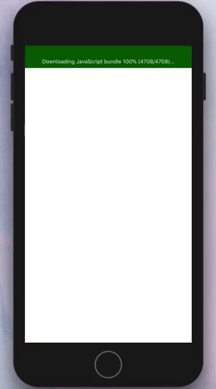

# React Native Image Blur Loading

React Native component for progressive image loading.



## Installation

Run in your root project directory

using NPM
```bash
$ npm install react-native-image-blur-loading
```
or using yarn
```bash
$ yarn add react-native-image-blur-loading
```

## Usage

```jsx
import React, { Component } from 'react';
import { View } from 'react-native';
import ImageBlurLoading from 'react-native-image-blur-loading'

// ...
const MyComponent = () => {
  return (
    <View style={{ flex: 1 }}>
      <ImageBlurLoading
        thumbnailSource={{ uri: 'https://picsum.photos/id/1/50/50' }}
        source={{ uri: 'https://picsum.photos/id/1/1000/1000' }}
        style={{ flex: 1, width: 'auto', height: 'auto', resizeMode: 'contain' }}
      />
    </View>
  )
}
```

## Properties
| Props | Description | Type | Required |  Default |
| --- | --- | --- | --- | --- |
| [Image props ...](https://facebook.github.io/react-native/docs/image#props) | It accepts all the [Image props](https://facebook.github.io/react-native/docs/image#props) | - | - |  - |
| `thumbnailSource` | The source of the thumbnail image. Should be a low resolution version of the image used in `source`. | ImageSourcePropType | No | - |
| `withIndicator` | Displaying `ActivityIndicator` component while the image is still loading. | boolean | No | `true` |
| `fastImage` | uses the FastImage component ([react-native-fast-image](https://github.com/DylanVann/react-native-fast-image)) to handle image caching. | boolean | No | `false` |
| `resizeMode` | Determines how to resize the image when the frame doesn't match the raw image dimensions. Defaults to `cover`. | ResizeMode | No | `cover` |

## Contributing
Pull requests are welcome. For major changes, please open an issue first to discuss what you would like to change.


## License
[MIT](https://choosealicense.com/licenses/mit/)